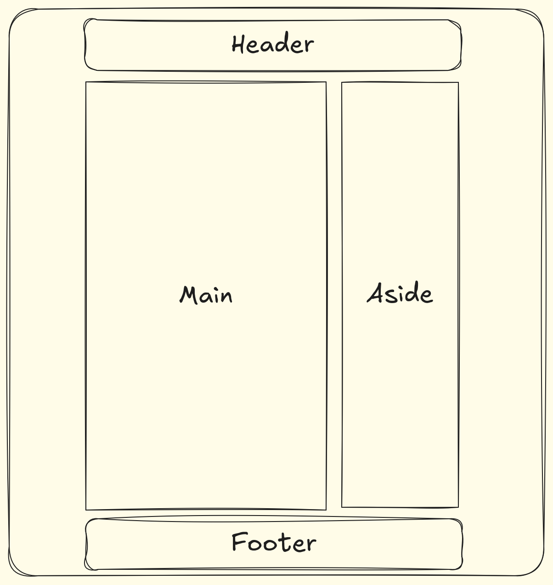

# Design Guidelines

For my web resume, I decided to go for a _minimal, high-contrast, and functional_ personality that is designed for reading, like the warm shades of paper. I was inspired by the classy, minimal look of an e-ink reader with a night mode light on.

# Color Scheme

The color scheme that I picked is called [Flexoki](https://stephango.com/flexoki), created by Steph Ango. An open-source color scheme under the MIT license.

This scheme suits the overall design I'm going for, which is a _minimal, paper-like_ resume for the web.

# Typography

I chose [Atkinsons Hyperlegible](https://www.brailleinstitute.org/freefont/) as my **main reading text**. I've been using this font for a while now and I really love how legible and distinct each letters are. This font is created by the Braille Institute and is designed to improve readability for individuals with low vision. It is also open-source under the SIL Open Font License.

While Atkinsons Hyperlegible is an amazing reading font, scaling it up to `40px` and more looks very dull and space consuming. So I went for [Inter](https://rsms.me/inter/) as my **main heading text**. Inter, to me, is a much more simpler Atkinson which is why it is a good contrast to the attention-grabbing Atkinson.

# Resume Layout

For my layout, I will go for a combination of a grid and flexbox.

The overall structure of my resume will use the Grid Layout. While my items in my header, footer, and sidebar will use flex.
